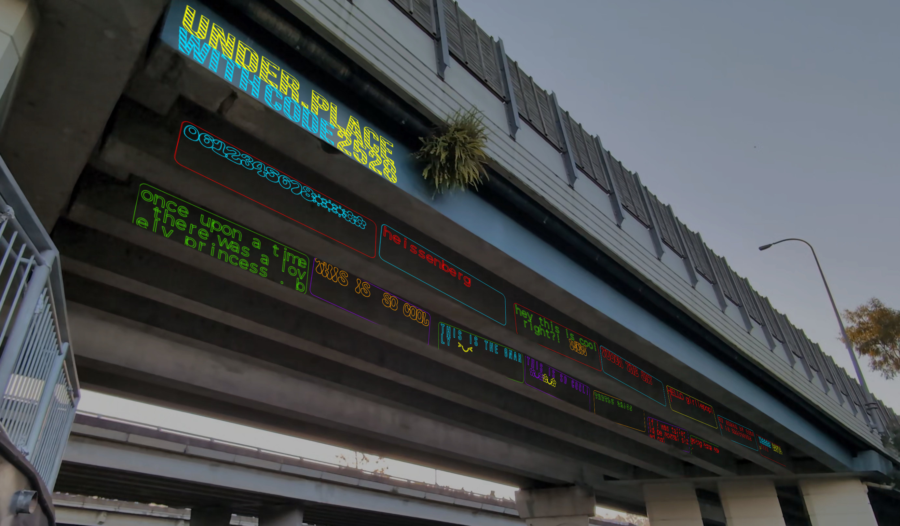

# Creative Narratives



**Creative Narratives** aims to investigate how collaborative public art installations could serve as a medium for supporting community narrative and awareness. The implementation and design documentation of this repository focuses on a location specific experience, **under.place** at the Ekibin Park South Street Art Wall. 

## Documentation

Please visit the wiki pages for the [Design Process Overview](https://github.com/DECO3500-SandyDingoes/CreativeNarratives/wiki/Design-Process-Overview), [Technical Specification](https://github.com/DECO3500-SandyDingoes/CreativeNarratives/wiki/Technical-Specification), [Ethical Considerations](https://github.com/DECO3500-SandyDingoes/CreativeNarratives/wiki/Ethical-Considerations), and [Ongoing Design documentation](https://github.com/DECO3500-SandyDingoes/CreativeNarratives/wiki/Ongoing-Design-Documentation).

## Repository Overview

This repository contains the components of the functional evaluation prototype, that can be either physicallay deployed at a location, or demonstarted using the simulated environment.

The prototype consists of three primary components, the editor, the serverless functions, and the installation.

- **Editor** (`/editor`) implements a mobile-first web application for the authoring and posts on the installation. The editor is designed to be deployed to Cloudflare's pages platform.
- **Serverless functions** (`/functions`) implements a HTTP web API with endpoints used to post and retrieve posts (content) from the backend database. It also implements authentication and provides an endpoint for managing the rolling connection code displayed on the installation. The endpoints are implemented using the serverless [Cloudflare pages functions](https://developers.cloudflare.com/pages/functions/) API. 
- **Installation** (`/installation`) implements a web application that fetches posts from the **serverless functions** API and renders them either into a simulated scene or as output ready to be projected.
  


## Build Instructions

***Node.js** and **NPM** must be installed for local development.*

The **editor** and **installation** allow for running locally via the following steps:

- **Install Dependencies**: To install dependencies run: `npm install`
- **Cloud Services (Cloudflare Pages Platform)**
	- Pages deployment configuration:
		- Build command: `npm -w editor run build`
		- Build output: `editor/dist`
	-	To use an existing API key, create the file `.\installation\.env.local` with the contents `INSTALLATION_KEY=<API_KEY_HERE>` where `<API_KEY_HERE>` is your API key.
	- To deploy your own API services, create the following resource bindings:
		- A *KV namespace* with name `kv` with key/values:
			- `INSTALLATION_KEY` = `<API_KEY_HERE>` *This is the API key used by the installation*
			- `code` = `1234` *This is the initial connection code before first start of the installation*
		- A *D1 store* with name `db` with schema:
			```
			CREATE TABLE "posts"(
				"id" TEXT NOT NULL,
				"created_time" INTEGER NOT NULL,
				"updated_time" INTEGER,
				"content" TEXT NOT NULL,
				PRIMARY KEY ("id")
			)
			```
- **Running Local Development Server:**
	- **Installation:** To start the local development server run: `npm -w installation run dev`
	- **editor:** To start the local development server run: `npm -w editor run dev`
- **Building for Production**
	- **Installation:** To start the local development server run: `npm -w installation run build`
	- **editor:** To start the local development server run: `npm -w editor run build`
